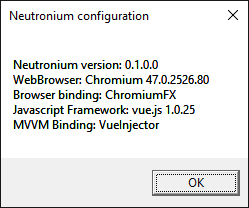

<p align="center"></p>

# Debug

## 1. Interactive Debug

### To activate Debug mode for HTLMLWindow or HTMLViewControl set IsDebug as true

In debug mode, 3 buttons will be displayed:


### _Inspect_ will open chromium javascript debug windows


### _Inspect VM_ will a javascript framework specific window to display information about the binding:


* For Vue.js
The [vue chrome debug tool](https://github.com/vuejs/vue-devtools) is opened in the HTML window
* For Knockout
An adaption of [knockout-view] a debug tool displaying ViewModel is used(https://github.com/jmeas/knockout-view)

### _About_ will open a windows displaying information about Neutronium configuration:



## 2. Trace 

By default, Neutronium will use the trace listener to log events. 
Neutronium will log binding errors as well as console.log message from the HTML session. 

If you need to use a different logger to output the Neutronium events you can implement your own IWebSessionLogger:


```CSharp
    public interface IWebSessionLogger
    {
        /// <summary>
        /// called for debug logging
        /// </summary>
        void Debug(Func<string> information);

        /// <summary>
        /// called for debug logging
        /// </summary>
        void Debug(string information);

        /// <summary>
        /// called for information logging
        /// </summary>
        void Info(string information);

        /// <summary>
        /// called for information logging 
        /// </summary>
        void Info(Func<string> information);

        /// <summary>
        /// called on critical event 
        /// </summary>
        void Error(string information);

        /// <summary>
        /// called on critical event 
        /// </summary>
        void Error(Func<string> information);

        /// <summary>
        /// called on each consolo log called by browser 
        /// </summary>
        void LogBrowser(ConsoleMessageArgs iInformation, Uri url);

        /// <summary>
        /// called in case of browser critical error
        /// </summary>
        void WebBrowserError(Exception exception, Action cancel);
    }
```

And then setting Neutronium Engine session logger:

```CSharp
var myLogger = new MyLogger();
HTMLEngineFactory.Engine.WebSessionLogger = myLogger;

```

### [Binding in Depth](./Binding-in-Depth)