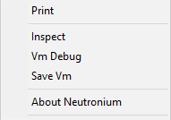

<p align="center"></p>

# Frequently Asked Questions

## **Why Neutronium?**

The idea behind Neutronium is to provide a HTML-CSS-Javascript UI engine enpowered with two way bindings supporting all features of WPF MVVM bindings.
This way Neutronium can be as "remplacement" of WPF.


## **How Neutronium compares with other libraries?**

* [Electron](http://electron.atom.io/)

Neutronium is electron for .NET? Well, kind of. Neutronium however is a higher abstraction so that you don't need to care about Chromium implementation such as renderer or browser processes.

* [Awesomium](http://www.awesomium.com/), [CefGlue](http://xilium.bitbucket.org/cefglue/), [ChromiumFx](https://bitbucket.org/chromiumfx/chromiumfx), [CefSharp](https://github.com/cefsharp/CefSharp)

All are libraries offering binding to Chromium using proprietary binding (Awesomium), or [Chromium Embedded Framewok](https://en.wikipedia.org/wiki/Chromium_Embedded_Framework) bindings. All of them present much lower level of integration than Neutronium. Note that internally Neutronium uses ChromiumFx.


* [react-native-windows](https://github.com/Microsoft/react-native-windows)

Provide react to WPF/UWP bindings. Almost the contrary aproach as Neutronium as react-to-native converts react to native UI component whereas Neutronium uses embeded web browser.


## **Why vue.js?**

[Vue.js](http://vuejs.org/) is providing C# to javascript binding in Neutronium application. Neutronium Core provide a generic architecture (see more [here](.\Architecture.md)) where javascript frameworj can be plugged in. This framework should provide reactivity with two way bindings and listeners patterns and should not be to opinionated in order to fit Neutronium MVVM workflow.

First version of neutronium was only using [knockout.js](http://knockoutjs.com/) which is compliant with these features.

Then appeared [Vue.js](http://vuejs.org/) which is also has same prerequisites but quickly with a much larger community. Vue.js beyond reactivity provides great tooling, powerful template engine, router, etc... As such Vue.js is the preferred option to develop with Neutronium.


##  **Is it possible to configure `same origin policy` or other browser features in a Neutronium application?**

[See here](./Accessing_Chromium_API.md)


## **How to implement a frameless HTML window?**

### 1. In the HTML markup:

Since version 0.6.0, Neutronium implements out of the box support for CSS property `-webkit-app-region: drag`:

```HTML
<div style="-webkit-app-region: drag">
</div>
```

This property make the whole div draggable.

You have to use `no-drag` value for buttons or other clickable regions with the draggable elements:
```CSS
button {
   -webkit-app-region: no-drag;
}
```

### 2. Window Buttons:

In order to help implement window interaction, Neutronium.WPF provides [WindowViewModel](../../Neutronium.WPF/ViewModel/WindowViewModel.cs) that exposes the `Close`, `Minize`, `Maximize` commands so that you can use it as a ViewModel for buttons

```CSharp
//window is the WPF window
var viewModel = new WindowViewModel(window);
```

### 3. WPF window:

To make a WPF window chromeless, Neutronium.WPF provides [Chromeless](../../Neutronium.WPF/Windows/Chromeless.cs) behavior:

```HTML
<Window x:Class="CodeVizualization.MainWindow"
    xmlns:neutronium="clr-namespace:Neutronium.WPF;assembly=Neutronium.WPF"   
    xmlns:i="clr-namespace:System.Windows.Interactivity; assembly=System.Windows.Interactivity">
    <i:Interaction.Behaviors>
        <neutronium:Chromeless />
    </i:Interaction.Behaviors>
```

This behavior creates a frameless window and takes care of expected drag-and-drop behavior.

See [Example.ChromiumFx.Vue.Chromeless](https://github.com/NeutroniumCore/Neutronium/tree/master/Examples/Example.ChromiumFx.Vue.Chromeless) example for a working example of frameless Neutronium Window.<br>
[Codegravity](https://github.com/NeutroniumCore/codegravity) and [Neutronium.SPA.Demo](https://github.com/NeutroniumCore/Neutronium.SPA.Demo) projects are also frameless window implementations.

## **How to display Window only when HTML control is rendering?**

`HTMLViewControl` and `HTMLWindow` both have a `IsHTMLLoaded` property that is set to true when HTML is rendered, so it is possible to bind the window visibility to this property.

Furthermore Neutronium.WPF provide a `BoolToHiddenConverter` that performs adequate conversion from `IsHTMLLoaded` to visibility transforming `false` into `Hidden` (standard `BooleanToVisibility` converts false into `Collapsed`).

Ex:
```HTML
<Window x:Class="MainWindow"
        xmlns:neutronium="clr-namespace:Neutronium.WPF;assembly=Neutronium.WPF">

<Window.Resources>
    <neutronium:BoolToHiddenConverter x:Key="BoolToHidden"/>
</Window.Resources>
    
<Grid>
    <neutronium:HTMLViewControl x:Name="HtmlView" RelativeSource="View\index.html" />
</Grid>

<Window.Visibility>
    <Binding ElementName="HtmlView" Path="IsHTMLLoaded" Converter="{StaticResource BoolToHidden}"/>
</Window.Visibility>
```

##  **Is it possible to print the content of the page?**

With [CEF APIs](http://magpcss.org/ceforum/apidocs3/projects/%28default%29/CefContextMenuHandler.html#OnBeforeContextMenu), it is possible to customize context menu and add a print command back to a Neutronium application.

To do so, 
1. register an event on browser OnDisplay

```CSharp
private void Window_Loaded(object sender, RoutedEventArgs e)
{
    HTMLViewControl.OnDisplay += WcBrowser_OnDisplay;        
}
```

2. Add an event on `ContextMenuHandler OnBeforeContextMenu`
```CSharp
private void WcBrowser_OnDisplay(object sender, Neutronium.Core.Navigation.DisplayEvent e)
{
    var windowCfx = wcBrowser.WPFWebWindow as IWPFCfxWebWindow;
    var cfxBrowser = windowCfx.ChromiumWebBrowser;
    cfxBrowser.ContextMenuHandler.OnBeforeContextMenu += ContextMenuHandler_OnBeforeContextMenu;
}
```

3. In `ContextMenuHandler_OnBeforeContextMenu` add the Print command
```CSharp
private void ContextMenuHandler_OnBeforeContextMenu(object sender, Chromium.Event.CfxOnBeforeContextMenuEventArgs e)
{
    var model = e.Model;
    model.InsertItemAt(0,(int)ContextMenuId.MENU_ID_PRINT, "Print");
    model.InsertSeparatorAt(1);
}
```

Result:<br>



See [Example.ChromiumFX.Vue.SOP](https://github.com/NeutroniumCore/Neutronium/tree/master/Examples/Example.ChromiumFX.Vue.SOP) for working example.


[How to set up a project](./SetUp.md) - [Overview](./Overview.md) - [Debug Tools](./Tools.md) - [Architecture](./Architecture.md)


