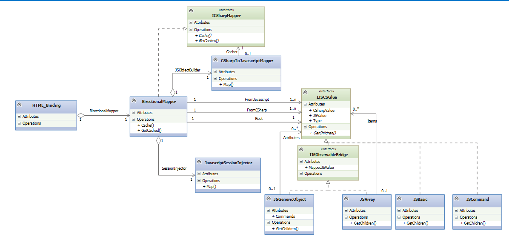

## Arquitecture


* **Neutronium.MVVMComponents.dll**

Add some abstraction to MVVM interfaces such as:

```CSharp
public interface IResultCommand
{
    Task<object> Execute(object iargument);
}
```

```CSharp
public interface ISimpleCommand
{
   void Execute(object argument);
}
```
Neutronium.Core provides binding to these interfaces 


* **Neutronium.Core.dll**

Core library that exposes abstraction such as WebBrowser and javascript engines and implements binding engine based on these interfaces. 
Neutronium.Core is UI library agnostic and does not depend on WPF library.

* **Neutronium.WPF.dll**

WPF implementation of UI abstrcation defined by Neutronium.Core.

* **JavascriptFrameworks**
 * **Neutronium.JavascriptFramework.Knockout**

   Knockout implementation of javascript binding

 * **Neutronium.JavascriptFramework.Vue**

   Vue implementation of javascript binding

* **WebBrowserEngines**
 * **Neutronium.WebBrowserEngine.Awesomium**

   Awesomium implementation of WebBrowser

 * **Neutronium.WebBrowserEngine.CefGlue**

   CefGlue implementation of WebBrowser

 * **Neutronium.WebBrowserEngine.ChromiumFx**

   ChromiumFx implementation of WebBrowser


Neutronium architecture is pluggable: as such it is possible for a third party to implement a WebBrowser adapter or a binding with different javascript framework and plug them to Neutronium.

## Binding Mechanism
When creating a binding, Neutronium uses reflection to create a network of glue objects that map the viewmodel and create javascript object corresponding to the viewmodel.

Then the root javascript object is transformed by javascript framework adapter that:

* creates if necessary a new object: for example knockout adapter create a new object where all properties are mapped using ko.observable et ko.observableArray
* subscribes to javascript changes calling C# method when changes are detected using framework listeners.
* maps javascript object: that is register them to the glue objects so that any glueobject knows its javascript homolog.

Once this is done, events are listened on the C# and javascript side and update are made when changes appear.

You need to dispose the binding to remove all the events listening.

